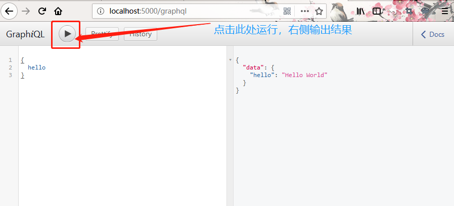
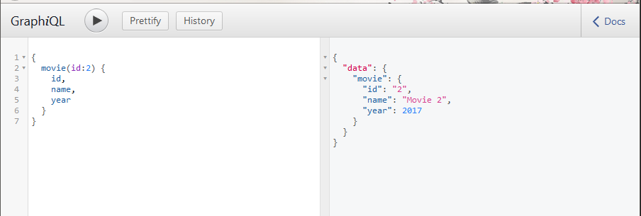
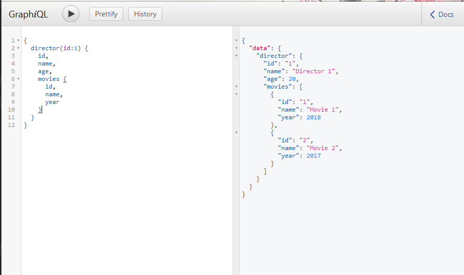

# GraphQL with node.js demo

### 运行项目

克隆整个项目，在编辑器中打开。

执行下面的命令安装相关依赖：
```
npm ci
```
OR
```
npm install
```

启动服务：
```
npm start
```

在浏览器里访问地址：http://localhost:5000/graphql

### 运行结果如下

**hello**


**movie**


**director**


### 链接

- 参考文章：https://www.infoq.cn/article/i5JMm54_aWrRZcem1VgH
